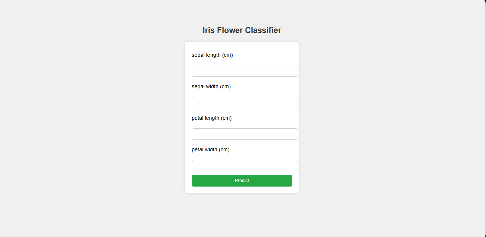

# KNN  
# 🌸 K-Nearest Neighbors Classification on Iris Dataset  

This project demonstrates **K-Nearest Neighbors (KNN)** classification on the classic `Iris` dataset using scikit-learn. The trained model is saved as a `.pkl` file for later use in applications such as web apps or APIs.  

---

## 📌 Project Overview  

- 📊 **Dataset:** `Iris` – one of the most famous datasets in machine learning, containing measurements of iris flowers from three species (*Setosa*, *Versicolor*, *Virginica*).  
- ⚙️ **Algorithm:** K-Nearest Neighbors (KNN)  
- 🎯 **Goal:** Train a classifier to predict the iris species based on flower measurements.  
- 💾 **Output:** A saved model file `knn_model.pkl` containing the trained KNN model and dataset metadata.  

---

## 🧪 Parameters  

- `n_neighbors`: Number of neighbors to consider for classification (set to **3** in this project).  

---

## 🔄 Workflow  

1. **Load Dataset:** Import the Iris dataset from `sklearn.datasets`.  
2. **Prepare Data:** Create a DataFrame and split it into features (`X`) and target labels (`y`).  
3. **Train/Test Split:** Split the data into 80% training and 20% testing.  
4. **Train Model:** Initialize and fit a `KNeighborsClassifier` with 3 neighbors.  
5. **Save Model:** Store both the trained model and dataset metadata in `knn_model.pkl` using `pickle`.  

---

## 📸 Screenshots

****

****

